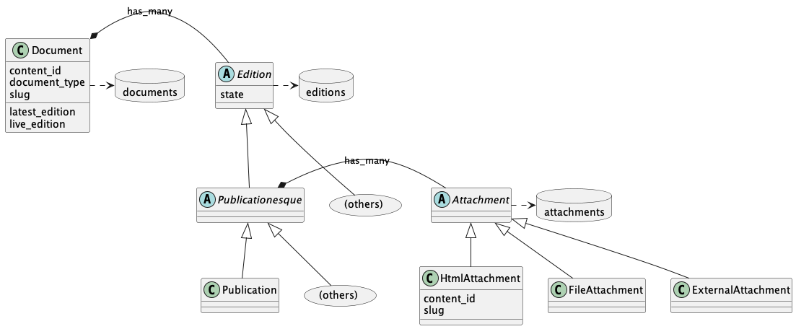

# Edition Model

This page documents only a subset of the full Document and Edition model world - it is a very complex area and any more detailed documentation risks being too complex to read, and it will rapidly become obsolete.  *The source code is the primary source of truth!*

Note, as a simplification, that concerns are not shown.  For instance `Attachment` is actually linked to an `Attachable` which is a concern mixed in by `Publicationesque`

There is a more detailed view of assets in the [Edition Asset Model](asset_management/edition_asset_model.md) document.

## Document

A document represents all iterations of a publishable document in Whitehall.  It stores the main document type, the `content_id` which links it to the [Publishing API](https://github.com/alphagov/publishing-api/blob/main/docs/model.md#content_id) and the slug, used to locate the document in web pages.

Each document can have multiple editions - they track the various major revisions of the document.  One edition will be the `latest_edition` and one may be the `live_edition` if the document is currently published.

## Edition

`Edition` is the parent of a whole forest of different classes that implement varying logic depending on the flavours of edition - the diagram only shows one, `Publication` for simplicity.

Editions have a `state` - see [Edition Workflow](edition_workflow.md) for more on the state.

## Attachment

Some editions, such as Publication and its siblings, have Attachments.  These are either html attachments (created using GovSpeak markup), or files, or external attachments.

HTML Attachments are special, in that they have their own `slug` and `content_id` - they are handled separately by the Publishing API - see below.

## Relationship to Publishing API model

Note that the Publishing API [has its own detailed model documentation](https://github.com/alphagov/publishing-api/blob/main/docs/model.md)

Be aware that **Documents and Editions in Whitehall do not always correspond directly with Documents and editions in the Publishing API**

A `Document` in Whitehall has a `content_id` which corresponts to a `content_id` in a matching `Document` in the Publishing API.

However Editions do not match 1:1 - Whitehall editions may go through many drafts and revisions which are never published, so will not be stored in the Publishing API.

Also a `HtmlAttachment` is handled as a standalone `Document` - it has its own `slug` and `content_id`; when it is published, it becomes a new `Document` in the Publishing API, with its own editions and workflow.
